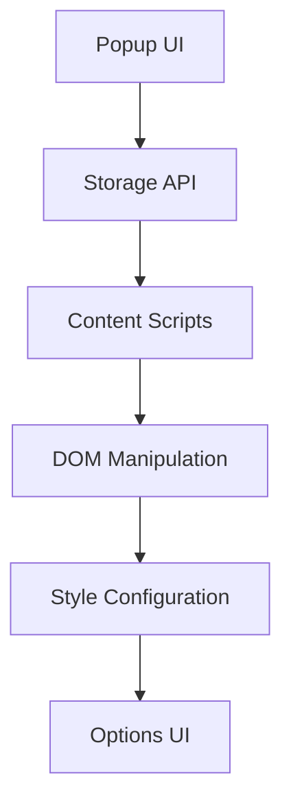

# Anti-Centel Browser Extension

## Overview

A Chrome/Firefox extension for monitoring and managing Twitter accounts with content moderation capabilities. Works adding Twitter/X accounts to a watchlist and setting actions and tags for them for monitoring, hiding, blurring, or highlighting tweets.

## Technical Stack

- React + Vite
- TypeScript
- Chrome Extension APIs
- Mantine UI
- PostCSS

## Features

1. **Tweet Management**
   - Hide/Blur tweets
   - Highlight suspicious accounts
2. **Watchlist System**
3. **Custom Styling**
4. **Options UI**

## Installation (Unpacked Extension)

### Chrome

```bash
# 1. Build the extension
npm run build

# 2. Open Chrome and navigate to:
chrome://extensions

# 3. Enable Developer Mode (top-right toggle)
# 4. Click "Load unpacked" and select:
./dist
```

### Firefox

```bash
# 1. Build Firefox version
npm run build:firefox

# 2. Open Firefox and visit:
about:debugging#/runtime/this-firefox

# 3. Click "Load Temporary Add-on"
# 4. Select any file in:
./dist-firefox
```

## Tag System & Actions

### Available Tags

| Tag          | Description                  | Associated Actions  |
| ------------ | ---------------------------- | ------------------- |
| `FAKE_NEWS`  | Identifies misinformation    | Monitor, Hide, Blur |
| `PARODY`     | Marks impersonation accounts | Monitor, Hide, Blur |
| `BOT`        | Marks bots                   | Monitor, Hide, Blur |
| `CONSPIRACY` | Marks conspiracy theories    | Monitor, Hide, Blur |
| `FAN_PAGE`   | Marks fan pages              | Monitor, Hide, Blur |
| `SEXUAL`     | Marks sexual content         | Monitor, Hide, Blur |
| `OFFICIAL`   | Marks official accounts      | Monitor, Hide, Blur |
| `AD`         | Marks ads                    | Monitor, Hide, Blur |
| `OTHER`      | General monitoring           | Monitor, Notify     |

### Action Types

1. **Monitor**: Track account activity
2. **Hide**: Collapse tweets completely
3. **Blur**: Obscure tweet content
4. **Highlight**: Visually emphasize tweets

### Development Setup

```bash
# Install dependencies
npm install

# Start dev server
npm run dev

# Lint code
npm run lint
```

### Contribution Guidelines

1. **Feature Requests**

   - Open issue with [Feature] tag
   - Include use case examples

2. **Bug Reports**

   - Provide reproduction steps
   - Attach console logs (via extension background page)

3. **Pull Requests**
   - Reference related issue
   - Update documentation
   - Include test cases

### Architecture Overview



### Code Structure

```
src/
├── content/               # Twitter interaction
│   ├── actions/           # hide/blur implementations
│   ├── utils/             # style utilities
│   └── content.ts         # main content script
├── popup/                 # extension UI
│   ├── components/        # React components
│   └── App.tsx            # popup root
├── options_ui/            # user preferences
│   ├── components/        # style editors
│   └── options.html       # config page
└── background/            # service workers
```

## Project Structure

```
├── src
│   ├── content/        # Twitter DOM manipulation
│   ├── popup/         # Extension popup UI
│   ├── options_ui/    # User configuration
│   ├── background/    # Service workers
│   └── icons/         # SVG assets
```

## Dependencies

- @mantine/core
- @chakra-ui/react
- chrome-types
- postcss
